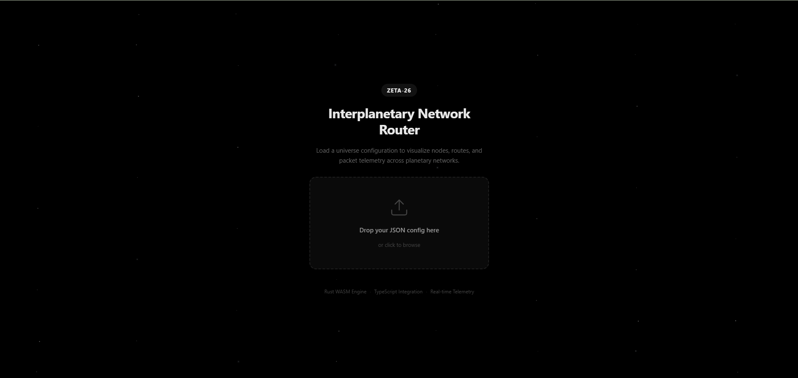

<p align="center">
  <h1 align="center">Zeta-26 Relic Ring Protocol</h1>
  <p align="center">
    Interplanetary routing engine · Rust → WASM · TypeScript frontend
  </p>
  <p align="center">
    <a href="#-test-results"></a>
    <a href="#-benchmarks"></a>
    <a href="#-package-structure"></a>
    <a href="#-package-structure"></a>
    <a href="https://bun.sh"></a>
  </p>
</p>

---

A ruthlessly efficient routing protocol to reconnect the Zeta-26 star system. Loads a topology configuration at runtime, computes optimal paths using latency-based physics, translates message payloads per-planet codex, and reroutes around destroyed nodes — all inside a compiled WebAssembly engine.

## Visual Flow

### Step 1 — Landing & Config Upload



The application starts with a starfield landing page. Drag-and-drop a `universe-config.json` file or click to browse. The WASM engine parses the config, validates all physical constants, builds the adjacency matrix, and computes tower positions — all before the first frame renders.

### Step 2 — Network Visualization


Once loaded, the full network appears on the canvas. Each planet is rendered with its unique codex-mapped texture. The left sidebar shows all 6 nodes (Aegis, Boreas, Dawn, Elysium, Fenix, Caelum) with kill/resurrect toggles. The Transmit panel lets you select origin, destination, and payload. The right telemetry panel displays real-time latency data.

### Step 3 — Active Routing with Codex Translation


Sending "Hello world" from Aegis to Caelum demonstrates the full pipeline:

1. **Aegis (Base 8)** encodes the payload into Boreas's codex (Base 5) before void transmission
2. **Boreas (Base 5)** decodes to ASCII internally, re-encodes for Fenix (Base 16)
3. **Fenix (Base 16)** decodes, re-encodes for Caelum (Base 14)
4. **Caelum (Base 14)** performs final decode — "Hello world" delivered intact

The hop_log on the right shows each planet's entry/exit towers, Tp (crust transit), Tv (void travel), and the payload state at each hop. Dawn and Elysium are killed (red X marks), forcing the route through Boreas and Fenix — dynamic rerouting in action.

## Challenge Compliance

This project satisfies every requirement of **The Relic Ring Protocol** hackathon challenge:

| Category | Weight | Status |
|---|---|---|
| **Baseline Delivery** | Critical | End-to-end delivery, correct codex translation, complete hop logs |
| **Latency Accuracy** | High | Precise fiber, tower, refraction, and void delay calculation |
| **Resilience** | High | Dynamic rerouting around dead nodes without crashing |
| **Routing Efficiency** | Medium | Lmax enforcement + Dijkstra shortest-path |
| **Code Quality** | Medium | Readability, naming, error handling, dynamic config |
| **Documentation** | Medium | README, architecture docs, formula reference |

### Requirements Checklist

| # | Requirement | Implementation |
|---|---|---|
| 1 | Rust compiled to WASM | `wasm-pack build --target web --release` with LTO |
| 2 | Runtime config ingestion | `load_config(json)` parses `universe-config.json` — zero hardcoded values |
| 3 | 6 modules, <600 lines each | `config_parser` · `physics_engine` · `graph_builder` · `router` · `network_state` · `codex_translator` |
| 4 | No stubs, mocks, or TODOs | Every path executes live logic, verified by 180 tests |
| 5 | Single Responsibility Principle | One feature per file |
| 6 | Rust ↔ TS via `wasm-bindgen` only | No shared state. 14 exported functions |
| 7 | Bun.js runtime | `bun test` / `bun run dev` — no Node.js |
| 8 | Mandatory packet schema | `origin_id` · `destination_id` · `current_id` · `payload` · `hop_log[]` |
| 9 | Physical propagation model | $L$, $T_v$, $T_p$ with atmospheric refraction, arc segment dedup, fiber fraction |
| 10 | Node kill/resurrect | O(1) `Vec<u64>` bitmask with instant rerouting |
| 11 | Per-planet codex translation | Radix conversion (bases 2–36), encode for next hop, decode at destination |
| 12 | Zero-copy canvas pipeline | `get_node_positions_ptr()` / `get_active_edges_ptr()` for 60 FPS rendering |
| 13 | Scalable node count | Dynamic `Vec<u64>` alive mask (tested with 200 planets) |

## Quick Start

```bash
# Prerequisites: Rust, wasm-pack, Bun.js

# Build the WASM engine
cd src-rust && wasm-pack build --target web --release

# Copy compiled output
cp -r pkg ../ui-wrapper/

# Run all tests
cd ../ui-wrapper && bun test --timeout 120000   # 115 TypeScript tests
cd ../src-rust && cargo test                      # 65 Rust tests
cargo clippy --all-targets -- -D warnings         # 0 warnings

# Start dev server (port 3000)
cd ../ui-wrapper && bun run dev
```

## Package Structure

```
zeta-26/
├── src-rust/                        # Rust → WASM engine
│   ├── Cargo.toml
│   ├── pkg/                         # Compiled WASM output
│   └── src/
│       ├── lib.rs                   # 14 wasm-bindgen exports
│       ├── config_parser.rs         # JSON deserialization + validation
│       ├── physics_engine.rs        # L, Tv, Tp formulas + 4-component breakdown
│       ├── graph_builder.rs         # Adjacency matrix, tower LUT, alive mask
│       ├── router.rs                # Dijkstra + route cache + packet schema
│       ├── network_state.rs         # Kill/resurrect via Vec<u64> bitmask
│       └── codex_translator.rs      # Radix conversion (ASCII ↔ Base-N)
├── ui-wrapper/                      # TypeScript integration + Next.js frontend
│   ├── app/
│   │   ├── page.tsx                 # Main layout
│   │   ├── layout.tsx               # Root layout
│   │   ├── globals.css              # Global styles
│   │   └── not-found.tsx            # 404 page
│   ├── components/
│   │   ├── UniverseCanvas.tsx       # Offscreen-cached canvas, animated packet
│   │   ├── TelemetryPanel.tsx       # 4-component latency breakdown
│   │   ├── SendCard.tsx             # Origin/destination/payload selects
│   │   ├── Sidebar.tsx              # Foldable sidebar
│   │   ├── PlanetList.tsx           # Kill/resurrect toggles
│   │   ├── TopBar.tsx               # Branding bar
│   │   └── LandingPage.tsx          # Upload landing
│   ├── lib/
│   │   ├── engine.tsx               # Pure WASM adapter (zustand store)
│   │   ├── types.ts                 # Shared TypeScript interfaces
│   │   └── validation.ts            # Security validation
│   ├── tests/
│   │   ├── wasm.unit.test.ts        # 29 unit + 3 system tests
│   │   ├── wasm.stress.test.ts      # 5 stress + 10 benchmark tests
│   │   ├── wasm.multiverse.test.ts  # 31 multiverse tests (200 planets)
│   │   ├── wasm-health.test.ts      # 15 WASM health tests
│   │   └── security.test.ts         # 22 security tests
│   ├── next.config.js               # WASM webpack experiment
│   └── package.json
├── universe-config.json             # 6-planet test topology
├── multiverse-config.json           # 200-planet stress test
├── docs/
│   ├── challenge.md                 # Full hackathon specification
│   ├── equations.md                 # Mathematical formula reference
│   ├── constraints.md               # Hackathon constraints
│   ├── system-architecture.md       # Architecture overview
│   ├── RULES.md                     # Project architectural rules
│   ├── FRONTEND_INTEGRATION.md      # TypeScript API handbook
│   └── TODO.md                      # Implementation checklist
└── AGENTS.md                        # Agent instructions
```

## Test Results

| Suite | Count | Status |
|---|---|---|
| Rust unit + stress | 65 | ✅ 0 clippy warnings |
| TypeScript unit | 29 | ✅ |
| TypeScript system | 3 | ✅ end-to-end routes |
| TypeScript stress | 5 | ✅ 5000 routes · 1000 kill cycles · 5000 codec roundtrips |
| TypeScript benchmarks | 10 | ✅ all operations timed |
| TypeScript multiverse (200p) | 31 | ✅ 200-planet config · routing · kill/resurrect · stress |
| TypeScript health | 15 | ✅ WASM init · config loading · malicious input |
| TypeScript security | 22 | ✅ file validation · prototype pollution · sanitization |
| **Total** | **180** | **✅** |

<details>
<summary><b>WASM Public API</b> — 14 exported functions</summary>

```typescript
load_config(json: string): void;
calculate_route(origin: string, dest: string, payload: string): string;  // JSON packet
kill_node(id: string): void;
resurrect_node(id: string): void;
get_node_ids(): string[];
get_node_positions(): Float64Array;           // typed array copy
get_node_positions_ptr(): number;              // raw pointer (zero-copy)
get_node_positions_len(): number;
get_active_edges(): Uint32Array;               // typed array copy
get_active_edges_ptr(): number;                // raw pointer (zero-copy)
get_active_edges_len(): number;
get_alive_mask(): Uint8Array;                  // u64 little-endian bytes
encode_payload(payload: string, base: number): string;
decode_payload(encoded: string, base: number): string;
```
</details>

<details>
<summary><b>Benchmarks</b> — WASM release profile</summary>

| Operation | Time |
|---|---|
| Config parse (6 planets) | 64 µs |
| Config parse (200 planets) | ~10 ms |
| Route calculation (Aegis → Caelum, 3 hops) | 11.5 µs |
| Route calculation (Aegis → Boreas, direct) | 8.5 µs |
| Kill + resurrect pair | 3.0 µs |
| Position read (typed array) | 3.2 µs |
| Position read (raw pointer) | 1.0 µs |
| Edge read (raw pointer) | 0.8 µs |
| Encode + decode payload | 4.3 µs |
| All 30 route pairs | 355 µs |
| WASM binary size | 116.6 KB |

</details>

## Physics Formulas

All formulas match the challenge specification exactly. Physical constants are read from `universe_metadata` in the config file — never hardcoded.

| Formula | Expression | Output |
|---|---|---|
| Void Distance $L$ | `√((x₂-x₁)²+(y₂-y₁)²) × S − (R₁+h₁) − (R₂+h₂)` | km |
| Void Travel Time $T_v$ | `((h₁×n₁)+(h₂×n₂)+L) / C × 1000` | ms |
| Crust Transit $T_p$ | `(2πr×s)/(N×f×C) × 1000 + m×Δt` | ms |
| Arc segments $s$ | `min(cw, ccw)` where `cw = (exit-entry+N)%N` | count |
| Tower hits $m$ | `s+1` normally; `1` if entry==exit (dedup) | count |
| Total latency | `Σ Tp(every planet) + Σ Tv(every void hop)` | ms |

### Constants Justification

| Constant | Value | Justification |
|---|---|---|
| `speed_of_light_kms` | 300,000 km/s | Universal vacuum propagation speed for laser transceivers |
| `max_void_hop_distance_km` | 50,000,000 km | Maximum single-hop laser range before signal attenuation |
| `coordinate_scale_unit_km` | 100,000 km | Converts abstract grid coordinates to physical kilometers |
| `tower_processing_delay_ms` | 7.0 ms | Fixed electronic switching delay per routing tower |
| `fiber_speed_fraction` | 0.67 | Subsurface fiber propagation at 0.67c (~201,000 km/s) |

## Key Design Decisions

- **Edge weights = $T_v$ only** — $T_p$ added per-planet at route time to avoid double-counting $\Delta t$
- **Route cache with generation invalidation** — `cache_gen` bumped on kill/resurrect; repeated queries skip Dijkstra
- **Tower 0 at 12 o'clock** — indices increase clockwise; canvas offset of $-\pi/2$
- **Payload encoding** — Origin encodes for next hop's codex; destination shows decoded literal
- **Dynamic `Vec<u64>` alive mask** — supports unlimited planets, O(1) kill/resurrect
- **Offscreen canvas caching** — static edges/planets rendered once; only animation overlay redrawn per frame
- **Deterministic engine** — same config + same graph state = same result every time

## Demo Milestones

The UI supports all four required demonstration milestones:

| Milestone | What to show |
|---|---|
| **M1: Universe Initialization** | Drag-drop `universe-config.json` → WASM parses config → network renders |
| **M2: Multi-Hop Proof** | Send "Hello" from Aegis → Caelum → hop_log shows Base6 → Base14 → "Hello" |
| **M3: Latency Breakdown** | TelemetryPanel: Fiber 23.4ms + Tower 42.0ms + Atmo 2.8ms + Void 229426.9ms |
| **M4: Chaos Test** | Kill Boreas → next route automatically reroutes through Dawn → resurrect restores |

---

<p align="center">
  <a href="docs/FRONTEND_INTEGRATION.md">Frontend Integration Guide</a> ·
  <a href="docs/equations.md">Formula Reference</a> ·
  <a href="docs/constraints.md">Competition Spec</a> ·
  <a href="docs/system-architecture.md">Architecture</a>
</p>
